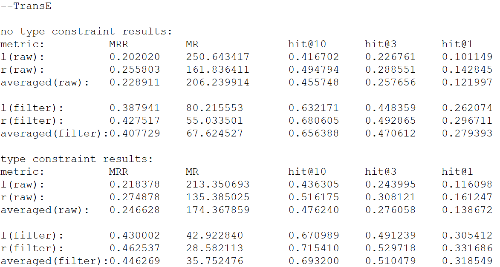

# OpenKE
An Open-source Framework for Knowledge Embedding.

For the original project please refer to:
https://github.com/thunlp/OpenKE

## Index
- [OpenKE](#openke)
  * [Index](#index)
  * [Overview](#overview)
  * [Repository structure](#repository-structure)
  * [Installation](#installation)
    + [General installation](#general-installation)
    + [Install on Google Colab](#install-on-google-colab)
  * [How to train?](#how-to-train-)
    + [Input](#input)
    + [Training](#training)
      - [Step 1](#step-1)
      - [Step 2](#step-2)
      - [Step 3](#step-3)
      - [Step 4](#step-4)
      - [Step 5](#step-5)
    + [Output](#output)
    + [Training on Google Colab](#training-on-google-colab)
  * [How to use the model?](#how-to-use-the-model-)
    + [Link Prediction](#link-prediction)
    + [Triple classification](#triple-classification)
    + [Usage example](#usage-example)
    + [Predict head entity](#predict-head-entity)
    + [Predict tail entity](#predict-tail-entity)
    + [Predict relation](#predict-relation)
    + [Classify a triple](#classify-a-triple)
  * [How to test the model?](#how-to-test-the-model-)
      - [Input](#input-1)
      - [Link Prediction Evaluation](#link-prediction-evaluation)
      - [Triple Classification Evaluation](#triple-classification-evaluation)
      - [Evaluation Example](#evaluation-example)
      - [Output](#output-1)
      - [Testing on Google Colab](#testing-on-google-colab)
  * [API](#api)
    + [Config](#config)
    + [Model](#model)

Table of contents generated with markdown-toc: http://ecotrust-canada.github.io/markdown-toc/


## Overview

This is an Efficient implementation based on TensorFlow for knowledge representation learning (KRL).  C++ is used to implement some underlying operations such as data preprocessing and negative sampling. For each specific model, it is implemented by TensorFlow with Python interfaces so that there is a convenient platform to run models on GPUs. 
In the code, the functionalities added and changes performed respect to the original project are marked as:  "**//@author EDIT**".

## Repository structure
The repository contains the following folders:
* **/base**: contains C++ files;
* **/benchmarks**: contains the dataset folders:
	* LastFm 
	* LibraryThing
	* Movielens
	* LastFm + LOD
	* LibraryThing + LOD
	* Movielens + LOD
* **/config**: contains python general API to configure a pipeline;
* **/examples**: contains some useful examples about how to train the models provided by the original authors (before train your model look at the examples and at the parameters required for each model);
* **/models**: contains python code about the models;
* **/release**: will contain a .so file after C++ compile;
* **/res**: will contain the embedding after model training.


## Installation
### General installation

1. Install TensorFlow

2. Clone the OpenKE repository:

```bash
$ git clone https://github.com/thunlp/OpenKE	//for the original repo
$ git clone https://github.com/swapUniba/OpenKE	//for the updated repo
$ cd OpenKE
```

3. Compile C++ files
	
```bash
$ bash make.sh
```

### Install on Google Colab

1. Connect Google Drive to store results (optional)
```python
from google.colab import drive
drive.mount('/content/gdrive')
```
2. Upload the project (OpenKE.zip) 

3. Unzip the project:
```bash
!unzip OpenKE.zip
```
4. Compile C++ files
```bash
!cd OpenKE; sh make.sh
```


## How to train?

### Input
For training, datasets must contain three files:

  1. train2id.txt: training file, the first line is the number of triples for training. Then the following lines are all in the format ***(head, tail, rel)*** which indicates there is a relation ***rel*** between ***head*** and ***tail*** .
  **Note that train2id.txt contains ids from entitiy2id.txt and relation2id.txt instead of the names of the entities and relations. If you use your own datasets, please check the format of your training file. Files in the wrong format may cause segmentation fault.**

  1. entity2id.txt: all entities and corresponding ids, one per line. The first line is the number of entities.
  **Note that entity2id.txt ids have to start from zero and have to be continuous (0,1,2,...). If your own dataset doesn't respect this, create a mapping file to keep trace of the orignal ids respect to the new ones.**

  1. relation2id.txt: all relations and corresponding ids, one per line. The first line is the number of relations.


### Training 

To compute a knowledge graph embedding, first import datasets and set configure parameters for training, then train models and export results. For instance, the file example_train_transe.py contains the code to train using TransE algorithm:

```python
import config
import models
import time

'''step 1'''
con = config.Config()
start_time = time.time()
path = "OpenKE/benchmarks/lastfm/"
con.set_in_path(path)

'''step 2'''
con.set_work_threads(8)
con.set_nbatches(100)
con.set_alpha(0.001)
con.set_margin(1.0)
con.set_dimension(64)
con.set_bern(0)
con.set_ent_neg_rate(1)
con.set_rel_neg_rate(0)
con.set_train_times(1000)
con.set_opt_method("SGD")

'''step 3'''
con.set_export_files("OpenKE/res/model.vec.tf")
con.set_out_files("OpenKE/res/embedding.vec.json")

'''step 4'''
con.init()
con.set_model(models.TransE)
con.run()

'''step 5'''
elapsed_time = time.time() - start_time
with open(path+"TIME.txt", "a+") as f:
    f.write("Number of seconds elapsed for training: " + str(elapsed_time) + "\n")
```

#### Step 1
Import the dataset and init a timer (to keep track of training time)

```python
con = config.Config()
start_time = time.time()
path = "OpenKE/benchmarks/lastfm/"
con.set_in_path(path)
```
#### Step 2
Set configure parameters for training. 
You can allocate several threads to sample positive and negative cases.

```python
con.set_work_threads(8)
```
Set essential parameters, including the data traversing rounds, learning rate, batch size, and dimensions of entity and relation embeddings.

```python
con.set_nbatches(100)
con.set_alpha(0.001)
con.set_margin(1.0)
con.set_dimension(64)
```
For negative sampling, entities and relations can corrupted to construct negative triples. set\_bern(0) will use the traditional sampling method, and set\_bern(1) will use the method in (Wang et al. 2014) denoted as "bern".

```python
con.set_bern(0)
con.set_ent_neg_rate(1)
con.set_rel_neg_rate(0)
```
Select a proper gradient descent optimization algorithm to train models and the number of epochs to perform.

```python
con.set_train_times(1000)
con.set_optimizer("SGD")
```


#### Step 3
Export the results. Models will be exported via tf.Saver() automatically every few rounds. Also, model parameters will be exported to json files finally. 

```python
con.set_export_files("OpenKE/res/model.vec.tf")
con.set_out_files("OpenKE/res/embedding.vec.json")
```


#### Step 4
Set the knowledge graph embedding model and start the training process.
```python
con.init()
con.set_model(models.TransE)
con.run()
```

#### Step 5
Store the training time in a file.
```python
elapsed_time = time.time() - start_time
with open(path+"TIME.txt", "a+") as f:
    f.write("Number of seconds elapsed for training: " + str(elapsed_time) + "\n")
```

### Output
The training output of this phase consists of:
* emebedding files stored in the **/res** directory;
* training time which is stored in the file **TIME.txt** which will be created in the dataset directory.

### Training on Google Colab
To train your model on Google Colab and store the results in your Google Drive use these commands:
```bash
!python OpenKE/example_train_transe.py
!zip -r 'gdrive/My Drive/your_folder/LastFmTransE64.zip' OpenKE/res OpenKE/benchmarks/lastfm/TIME.txt 
```


## How to use the model?
There are two tasks already implemented in the repository, which can be used once the embeddings have been learned: **Link prediction** and **Triple classification**.

### Link Prediction
Link prediction aims to predict the missing h (predict_head_entity), t (predict_tail_entity) or r (predict_relation) for a relation fact triple (h,r,t). In this task, for each position of missing entity, the system is asked to rank a set of  k (additional parameter of the methods) candidate entities from the knowledge graph, instead of only giving one best result. Given a specific test triple (h,r,t) from which to predict the missing head/tail/relation, the head/tail/relation is replaced by all entities/relations in the knowledge graph, and these triples are ranked in order of similarity/distance scores. Prediction can be performed respect to head/tail/relation by using the corresponding methods to get the top k predictions from the ranked list.

### Triple classification
Triple classification aims to judge whether a given triple (h,r,t) is correct or not (a binary classification task). For triple classification, is used a threshold δ: for a given triple if the score obtained by the triple is below δ, the triple will be classified as positive, otherwise as negative. The threshold can be passed as a parameter to the method predict_triple, or can be optimized by maximizing classification accuracies on the validation set.

### Usage example
To use a knowledge graph embedding model (already learned) first import the embeddings and then use methods for link prediction and triple classification. For instance, the file example_usage_transe.py contains the script to load a model and use it:

```python
import config
import models

'''step 1: Load the dataset and embedding files'''
con = config.Config()
con.set_in_path("OpenKE/benchmarks/lastfm/")
con.set_import_files("OpenKE/res/model.vec.tf")    
con.set_work_threads(8)
con.set_dimension(64)

'''step 2: init the model'''
con.init()
con.set_model(models.TransE)

'''step 3: perform your operation'''
con.predict_head_entity(1928, 1, 5)
con.predict_tail_entity(0, 1, 5)
con.predict_relation(0, 1928, 5)
con.predict_triple(0, 1928, 1)
```

### Predict head entity
Given tail entity and relation, predict the top k possible head entities. All the objects are represented by their id. The method to use is *predict_head_entity(t, r, k)*  which predicts the top k head entities given the tail entity (*t*) and the relation (*r*).
```python
con.predict_head_entity(1928, 1, 5)
```
### Predict tail entity
This is similar to predicting the head entity. The method to use is *predict_tail_entity(h, r, k)* which predicts the top k tail entities given the head entity (*h*) and the relation (*r*).
```python
con.predict_tail_entity(0, 1, 5)
```
### Predict relation
Given the head entity and tail entity, predict the top k possible relations. All the objects are represented by their id. The method to use is *predict_relation(h, t, k)* which predicts the relation id given head entity and tail entity.
```python
con.predict_relation(0, 1928, 5)
```

### Classify a triple
Given a triple (h, r, t), this funtion tells us whether the triple is correct or not. If the threshold is not given, this function calculates the threshold for the relation from the valid dataset (in this case stored in *OpenKE/benchmarks/lastfm/valid2id.txt*). The method to use is *predict_triple(h, t, r, thresh = None)*.
```python
con.predict_triple(0, 1928, 1)
```

## How to test the model?

#### Input
* For testing, datasets directory must contain additional two files (totally five files with the training files):

  1. test2id.txt: testing file, the first line is the number of triples for testing. Then the following lines are all in the format ***(head, tail, rel)*** .

  1. valid2id.txt: validating file, the first line is the number of triples for validating. Then the following lines are all in the format ***(head, tail, rel)*** .

* Optional files: each dataset contains the file "n-n.py" which can be used to generate the following additional files:

  1. type_constrain.txt: the first line is the number of relations; the following lines are type constraints for each relation. For example, the line “1200 4 3123 1034 58 5733” means that the relation with id 1200 has 4 types of head entities (if another line with relation id equals to 1200 is written, it will refer to tail entities constraints), which are 3123, 1034, 58 and 5733.

#### Link Prediction Evaluation
The protocol used for link prediction evaluation is a little bit intricated. For each test triple, the following operations are performed:
* corrupted triplets are created by removing the head and replacing it by each of the entities of the dictionary in turn;
* the set composed by the original test triple with its corrupted triples is created;
* for each triple in the set is computed the score function of the trained model;
* the triples in the set are ranked respect to the score function (so that on the top of the list, we should have the most recommendable triples); logically, the algorithm performs well if on top of the list are present valid triples;
* The evaluation metrics (which will be explained later) are computed using this list.

The procedure is repeated for each test triple and, at the end, average results are reported. Moreover, these steps are performed again while removing the tail (referred as **r** in this process, i.e. the right part of the triple) instead of the head (referred as **l** in this process, i.e. the left part of the triple).  Using this procedure, it could be possible that the constructed corrupted triples set for a specific test triplet, may contain triples which end up being valid ones because are already contained either in the training, validation or test set. For this reason, the authors have divided the results for evaluation with two different criteria: the original corrupted set (called **raw**, i.e. using the procedure explained above) and the **filtered** one i.e. without the corrupted triples (except the test triplet of interest of course) which appear in either the training, validation or the test set (to ensure that all corrupted triplets do not belong to the data set). Moreover, the results are further divided respect to if they are taking in account the triple constraints (present in the file type_constrain.txt) or not. 
For link prediction evaluation, the metrics given as output are the following:
* MR: mean rank of correct entities (the lower the mean, the better the results);
* MRR: the average of the reciprocal ranks of correct entities (the more the MRR is near to 0, the worst the results);
* Hit@N: proportion of correct entities in top-N ranked entities (the greater the Hit@N, the better the results).

The image below shows an example of the output given from the software for the link prediction evaluation task.



As can be deduced from the image above, the results are divided using different criteria:
* Using / not using the relation constraints available in the file type_constrain.txt;
* Using raw / filter (without the corrupted triples which appear in either the training or the validation or the test set) set;
* Using the evaluation process for the head (l) or the tail (r). 


#### Triple Classification Evaluation
The protocol used for triple classification evaluation is more easy respect to the previous one. Since this task needs negative labels, each golden test triplet is corrupted to get only one negative triplet. The resulting set of triplets are stored in a file named test_neg.txt (which contains twice the number of test triplets of course). In the latter is used an additional column to mark the corrupted triplets with a negative value (-1) and the golden triplets with a positive value (+1). The same procedure is repeated for the validation set, to obtain the valid_neg.txt file. As explained before, the classification task needs a threshold, which is learned using the valid_neg.txt. The validation set, is used only to tune the threshold for classification purpose. Finally, the so learned threshold, is used to classify the triplets contained in the test_neg.txt file. The metric reported for triple classification is only the accuracy. 

#### Evaluation Example
To evaluate both triple classification and link prediction task, use the following workflow (contained in the file *example_evaluation_transe.py*):

```python
import config
import models
import time

'''step 1: init operations'''
start_time = time.time()
path = "OpenKE/benchmarks/lastfm/"
con = config.Config()
con.set_in_path(path)
con.set_import_files("OpenKE/res/model.vec.tf")

'''step 2: specify the evaluation task to perform (link prediction and/or triple classification)'''
con.set_test_link_prediction(True)
con.set_test_triple_classification(True)  
con.set_work_threads(8)
con.set_dimension(64)

'''step 3: set the model and test it'''
con.init()
con.set_model(models.TransE)
con.test()

'''step 4: store the evaluation time'''
elapsed_time = time.time() - start_time
with open(path+"TIME_evaluation.txt", "a+") as f:
    f.write("Number of seconds elapsed for evaluation: " + str(elapsed_time) + "\n")
```
#### Output
The output of evaluation consists in the following files which are stored in the datset directory:
* **test_neg.txt:**: generated from triple classification task; since this task needs negative labels, each golden test triplet (marked with +1 in the 4th column) is corrupted to get only one negative triplet (marked with -1 in the 4th column). The resulting set of triplets are stored in this file (which contains twice the number of test triplets of course). This file contains the "ground truth"
* **valid_neg.txt**: generated from triple classification task; the logic is the same of the previous file; this file contains twice the number of the validation triple (for each validation triple is generated a corrupted triple);
* **TIME.txt**: contains the time to perform evaluation;
* **test_CLASSIFICATION.txt**: generated from triple classification task; this file contains the same triples contained in the file **test_neg.txt** but stored with a different logic. Each triple is marked (in the 4th column) with +1 if the model learned classify it as correct, -1 otherwise. You can use this file in combination with **test_neg.txt** to compute True positive, True negative, etc.
* **test_CLASSIFICATION_RESULTS.txt**: contains the metric given as output by the triple classification task; the default metric is accuracy but you can compute other metrics by yourself using the files **test_neg.txt** and **test_CLASSIFICATION.txt**;
* **test_LINK_PREDICTION_RESULTS.txt**: contains the metric given as output by the link prediction evaluation task.

#### Testing on Google Colab
To test your model on Google Colab and store the results in your Google Drive use these commands:
```bash
!python OpenKE/example_evaluation_transe.py
!zip -r 'gdrive/My Drive/your_folder/LastFmTransE64_evaluation.zip' OpenKE/benchmarks/lastfm/test_neg.txt OpenKE/benchmarks/lastfm/valid_neg.txt OpenKE/benchmarks/lastfm/TIME.txt OpenKE/benchmarks/lastfm/test_CLASSIFICATION.txt OpenKE/benchmarks/lastfm/test_CLASSIFICATION_RESULTS.txt OpenKE/benchmarks/lastfm/test_LINK_PREDICTION_RESULTS.txt  

```

## API

### Config

```python
class Config(object):

	#To set the learning rate
	def set_alpha(alpha = 0.001)

	#To set the degree of the regularization on the parameters
	def set_lmbda(lmbda = 0.0)

	#To set the gradient descent optimization algorithm (SGD, Adagrad, Adadelta, Adam)
	def set_optimizer(optimizer = "SGD")

	#To set the data traversing rounds
	def set_train_times(self, times)

	#To split the training triples into several batches, nbatches is the number of batches
	def set_nbatches(nbatches = 100)

	#To set the margin for the loss function
	def set_margin(margin = 1.0)

	#To set the dimensions of the entities and relations at the same time
	def set_dimension(dim)

	#To set the dimensions of the entities
	def set_ent_dimension(self, dim)

	#To set the dimensions of the relations
	def set_rel_dimension(self, dim)

	#To allocate threads for each batch sampling
	def set_work_threads(threads = 1)

	#To set negative sampling algorithms, unif (bern = 0) or bern (bern = 1)
	def set_bern(bern = 1)

	#For each positive triple, we construct rate negative triples by corrupt the entity
	def set_ent_neg_rate(rate = 1)

	#For each positive triple, we construct rate negative triples by corrupt the relation
	def set_rel_neg_rate(rate = 0)

	#To sample a batch of training triples, including positive and negative ones.
	def sampling()

	#To import dataset from the benchmark folder
	def set_in_path(self, path)

	#To export model parameters to json files when training completed
	def set_out_files(self, path)

	#To set the import files, all parameters can be restored from the import files
	def set_import_files(self, path)

	#To set the export file of model paramters, and export results every few rounds
	def set_export_files(self, path, steps = 0)

	#To export results every few rounds
	def set_export_steps(self, steps)

	#To save model via tf.saver
	def save_tensorflow(self)

	#To restore model via tf.saver
	def restore_tensorflow(self)

	#To export model paramters, when path is none, equivalent to save_tensorflow()
	def export_variables(self, path = None)

	#To import model paramters, when path is none, equivalent to restore_tensorflow()
	def import_variables(self, path = None)

	#To export model paramters to designated path
	def save_parameters(self, path = None)

	#To manually load parameters which are read from json files
	def set_parameters(self, lists)

	#To get model paramters, if using mode "numpy", you can get np.array , else you can get python lists
	def get_parameters(self, mode = "numpy")

	#To set the knowledge embedding model
	def set_model(model)

	#The framework will print loss values during training if flag = 1
	def set_log_on(flag = 1)

	#This is essential when testing
	def set_test_link_prediction(True)
def set_test_triple_classification(True)
```


### Model

```python
class Model(object)

	# return config which saves the training parameters.
	get_config(self)

	# in_batch = True, return [positive_head, positive_tail, positive_relation]
	# The shape of positive_head is [batch_size, 1]
	# in_batch = False, return [positive_head, positive_tail, positive_relation]
	# The shape of positive_head is [batch_size]
	get_positive_instance(in_batch = True)

	# in_batch = True, return [negative_head, negative_tail, negative_relation]
	# The shape of positive_head is [batch_size, negative_ent_rate + negative_rel_rate]
	# in_batch = False, return [negative_head, negative_tail, negative_relation]
	# The shape of positive_head is [(negative_ent_rate + negative_rel_rate) * batch_size]		
	get_negative_instance(in_batch = True)

	# in_batch = True, return all training instances with the shape [batch_size, (1 + negative_ent_rate + negative_rel_rate)]
	# in_batch = False, return all training instances with the shape [(negative_ent_rate + negative_rel_rate + 1) * batch_size]
	def get_all_instance(in_batch = False)

	# in_batch = True, return all training labels with the shape [batch_size, (1 + negative_ent_rate + negative_rel_rate)]
	# in_batch = False, return all training labels with the shape [(negative_ent_rate + negative_rel_rate + 1) * batch_size]
	# The positive triples are labeled as 1, and the negative triples are labeled as -1
	def get_all_labels(in_batch = False)

	# To define containers for training triples
	def input_def()

	# To define embedding parameters for knowledge embedding models
	def embedding_def()

	# To define loss functions for knowledge embedding models
	def loss_def()

	# To define the prediction functions for knowledge embedding models
	def predict_def(self)

	def __init__(config)

#The implementation for TransE
class TransE(Model)

#The implementation for TransH	
class TransH(Model)

#The implementation for TransR
class TransR(Model)

#The implementation for TransD
class TransD(Model)

#The implementation for RESCAL
class RESCAL(Model)

#The implementation for DistMult
class DistMult(Model)

#The implementation for HolE
class HolE(Model)					

#The implementation for ComplEx
class ComplEx(Model)
```
